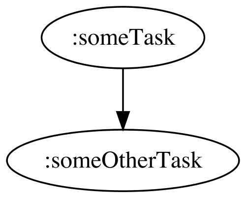

# Inspector Graphetto

<p>
<a href="https://plugins.gradle.org/plugin/at.droiddave.graphetto/0.0.1-SNAPSHOT" alt="Gradle Plugin">
    
</a>
</p>

_Inspector Graphetto_ is a Gradle build plugin to inspect and visualize the task execution graph of your build. 

## Installation

Inside your top-level Gradle file add the Inspector Graphetto plugin:

**In a `build.gradle` file (Groovy):**
```groovy
plugins {
    id 'at.droiddave.graphetto' version '0.0.1'
}
```

**In a `build.gradle.kts` file (Kotlin DSL):**

```kotlin 
plugins {
    id("at.droiddave.graphetto") version "0.0.1"
}
```

## Usage

Simply run a build for any task using the `-Dat.droiddave.graphetto.enabled=true` option, and Inspector Graphetto will write a GraphViz `.dot` file to `build/reports/graphetto/graph.dot`.

```shell
$ ./gradlew someTask -Dat.droiddave.graphetto.enabled=true
$ cat build/reports/graphetto/graph.dot

strict digraph G {
  1 [ label=":someOtherTask" ];
  2 [ label=":someTask" ];
  2 -> 1;
}
```

### Console Printing

To print the entire task dependency graph to the console, use the `-Dat.droiddave.graphetto.consoleOutput=TREE` option:

```shell 
$ ./gradlew someTask -Dat.droiddave.graphetto.consoleOutput=TREE

 ── :someTask
    └── :someOtherTask

> Task :someOtherTask UP-TO-DATE
> Task :someTask UP-TO-DATE

BUILD SUCCESSFUL in 92ms
```

### Image Rendering

Inspector Graphettto can also render PNG or PDF files of the task using GraphViz. To do so, you can set the `-Dat.droiddave.graphetto.outputFormat` property to either `PNG` or `PDF`:

```shell 
$ ./gradlew someTask -Dat.droiddave.graphetto.outputFormat=PNG
```

This will render a PNG file to `build/reports/graphetto/graph.png`:



## Configuration

The plugin registers an extension called `graphetto` on your project which can be used to configure the output:

```groovy
graphetto {
    enabled = true
    dotFile = "$buildDir/reports/graphetto/graph.dot"
    renderFormat = RenderFormat.PNG
    outputFile = "$buildDir/reports/graphetto/graph.png"
    consoleOutput = at.droiddave.graphetto.ConsoleOutput.TREE
}
```

### `enabled`

*Default:* `false`  
*Command line option:* `at.droiddave.graphetto.enabled=[true|false]`

Enables task graph report generation. This is disabled by default to not affect build times, and should only be enabled on demand (i.e. if a task graph report should be generated).

When running a build from the command line, you can enable report generation using the `-Dat.droiddave.graphetto.enabled=true` option:

```shell 
./gradlew assembleDebug -Dat.droiddave.graphetto.enabled=true
```

Alternatively, to enable report generation inside your Gradle build file, simply set the `graphetto.enabled` DSL property to `true`:

```groovy
graphetto {
    enabled = true
}
```

Note that the command line option takes precedence over the value configured via the DSL, and can therefore be used to override the default.

### `dotFile`

Configures the path of the `.dot` output file containing the information about the task graph that was executed. Defaults to `reports/taskGraph/graph.dot`.  

```groovy
graphetto {
    dotFile = new File(buildDir, 'reports/my-task-graph.dot')
}
```

### `consoleOutput`

Configures the type of console output produced by the plugin.

* `TREE` will print the entire task dependency tree before after the configuration phase of your build.
* `NONE` will not print any console output. This is the default.

```groovy
graphetto {
    consoleOutput = at.droiddave.graphetto.ConsoleOutput.TREE
}
```

You can also override the current configuration by passing the `-Dat.droiddave.graphetto.consoleOutput=TREE` option when invoking your build on the command line.
